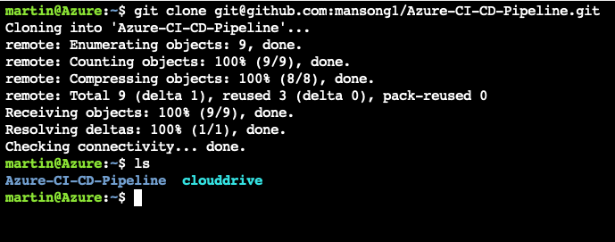
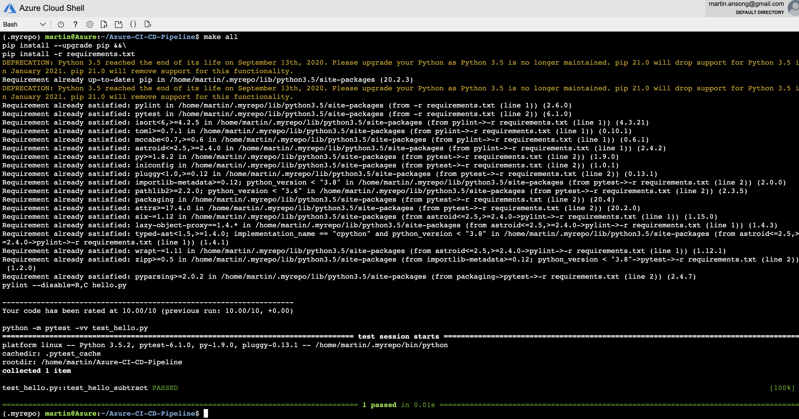

# Overview

Agile Development using Azure Cloud Shell, Github Actions for our CI and Azure Pipelines for our CD.

We will build and deploye a containerised flask application that serves out predictions (inference) about housing prices through API calls. This project could be extended to any pre-trained machine learning model, such as those for image recognition and data labeling. It utilises a pre-trained `sklearn` model that has been trained to predict housing prices in Boston according to several features, such as average rooms in a home and data about highway access, teacher-to-pupil ratios, and so on. You can read more about the data, which was initially taken from Kaggle, on [the data source site](https://www.kaggle.com/c/boston-housing).

## Project Plan

## Instructions

### Azure Cloud Shell

1. Clone the repo into your Azure Cloud Shell


2. Run `make all` command from the `Makefile`



### Github Actions

1. Enable Github Actions
2. We use ./github/workflows/pythonapp.yml to define our flow
3. Below is a screenshot verifying remote tests passing: 


### Azure Pipelines

1. Create an Azure pipeline referring to these [instructions]((https://docs.microsoft.com/en-us/azure/devops/pipelines/ecosystems/python-webapp?view=azure-devops)


### Making a Prediction

Successful prediction from deployed flask app in Azure Cloud Shell.  [Use this file as a template for the deployed prediction](https://github.com/udacity/nd082-Azure-Cloud-DevOps-Starter-Code/blob/master/C2-AgileDevelopmentwithAzure/project/starter_files/flask-sklearn/make_predict_azure_app.sh).

The output should look similar to this:

```bash
udacity@Azure:~$ ./make_predict_azure_app.sh
Port: 443
{"prediction":[20.35373177134412]}
```

## Enhancements


## Demo