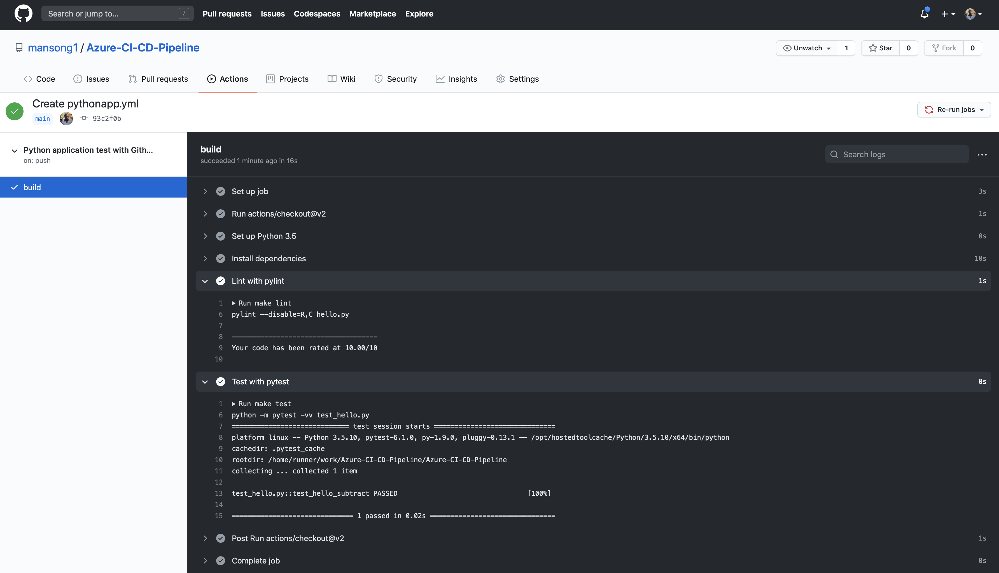

# Azure-CI-CD-Pipeline
Building a CI/CD Pipeline in Azure with Azure Cloud Shell

### Github Actions

1. Enable Github Actions
2. We use ./github/workflows/pythonapp.yml to define our flow
3. Below is a screenshot verifying remote tests passing: 
